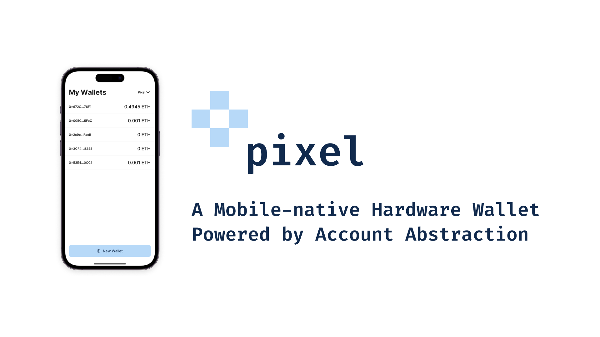

# Pixel



## About

Pixel is an ERC-4337 account implementation and Optimistic Rollup that turns every modern smartphone on the planet into a hardware wallet, eliminating the security risks and poor user experience associated with manual private key management.

All modern smart phones contain a Hardware Security Module that can securely create ECDSA keypairs and use them to generate signatures along the P256 (secp256r1) curve. However, EVM based blockchains do not natively support signature verification along the P256 curve - they use the Koblitz (secp256k1) curve instead. This makes it impossible use smart phone HSMs to sign Ethereum transactions, even though they are ideally suited for this purpose.

Pixel overcomes this limitation by implementing P256 signature validation on-chain and using it to validate ERC-4337 account transactions. This approach gives every ECDSA P256 public key a unique Ethereum account address that can be used across any EVM blockchain where Pixel is deployed (currently Goerli, Gnosis Chain, Scroll, and Polygon ZK EVM).

Since on-chain solidity-based P256 signature verification can be very gas-intensive (500k-1M gas), Pixel also provides its own Optimistic Rollup that natively supports P256 signature verification using a custom precompile. By verifying signatures natively, Pixel Rollup reduces gas costs for Pixel Wallet transactions by over 92% compared to Goerli.

Combined together, Pixel Wallet and Pixel Rollup can help scale Ethereum by putting a gas-efficient, hardware-secured, and user friendly Ethereum wallet in every pocket.

Pixel was built during the Scaling Ethereum 2023 Hackathon by @jaydenwindle and @hwrdtm.

## Technical Details

During the hackathon, we built three core components:

- 📜 An ERC-4337 account abstraction implementation that uses P256 signatures for transaction validation
- ⛓️ An Optimistic Rollup that implements native P256 signature verification using a pre-compiled contract
- 📱 A mobile application for interacting with Pixel Wallets

Pixel Wallet is a smart contract account written using solidity that implements the ERC-4337 interface, making it compatible with the ERC-4337 bundler and mempool. This means that users can interact with their Pixel Wallet without even knowing that it's a smart contract, as contract deployment is automatically handled the first time they submit a transaction to the network.

All Pixel Wallets are deployed using a custom CREATE2 factory, ensuring that each ECDSA public key has the same account address across all EVM chains. We wrote the smart contracts using Foundry and deployed them to Goerli, Gnosis Chain, Scroll, Polygon ZK EVM, and Pixel.

The following smart contracts were deployed on each chain:

- ERC-4337 EntryPoint: 0x8943AAAE85a913B70AD5Ab0042f9FEAcadcd7c75
- Account Factory: 0x58675fDe870aC281F510913Ea7616b384007b6d6
- Account Implementation: 0x76CfA959b9605F53Ca7a7cFB91EdA402a2CdE462
- P256 Verifier: 0x5eea9C2527B5864BaDC050FcB1771c78240Acd4E

ERC-4337 account transactions are submitted to a Bundler which executes them on-chain. We spun up a bundler instance using Stackup (https://github.com/stackup-wallet/stackup-bundler) and used it to handle all Pixel Wallet transactions.

Pixel Rollup is an OP Stack-based optimistic rollup. We forked Optimism's op-geth implementation and wrote a native P256 verification precompile using go's built-in ECDSA library. If Pixel Wallet detects the pre-compiled contract, it will use it instead of the solidity implementation. We spun up op-geth, op-node, and op-batcher on a remote node hosted on Vultr.

The Pixel App was built using React Native and Expo. We created a custom native module for interacting with the iOS Secure Enclave, allowing us to generate ECDSA P256 private keys and use them to sign transactions. We used Tamagui (https://tamagui.dev/) as a UI framework.

## Running Locally

### Mobile App

```bash
$ cd expo-hardware-ecdsa
$ yarn install
$ cd example
$ yarn install
$ yarn expo run:ios
```

### Contracts

```bash
$ cd contracts
$ forge install
$ forge test
```

### Rollup

Follow the instructions in the [OP Stack Docs](https://stack.optimism.io/docs/build/getting-started/#get-some-eth-on-your-rollup), but use `op-geth` from this repository instead
